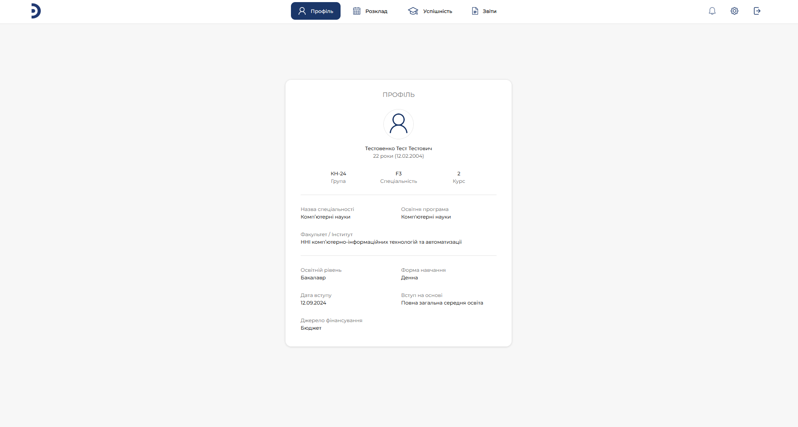
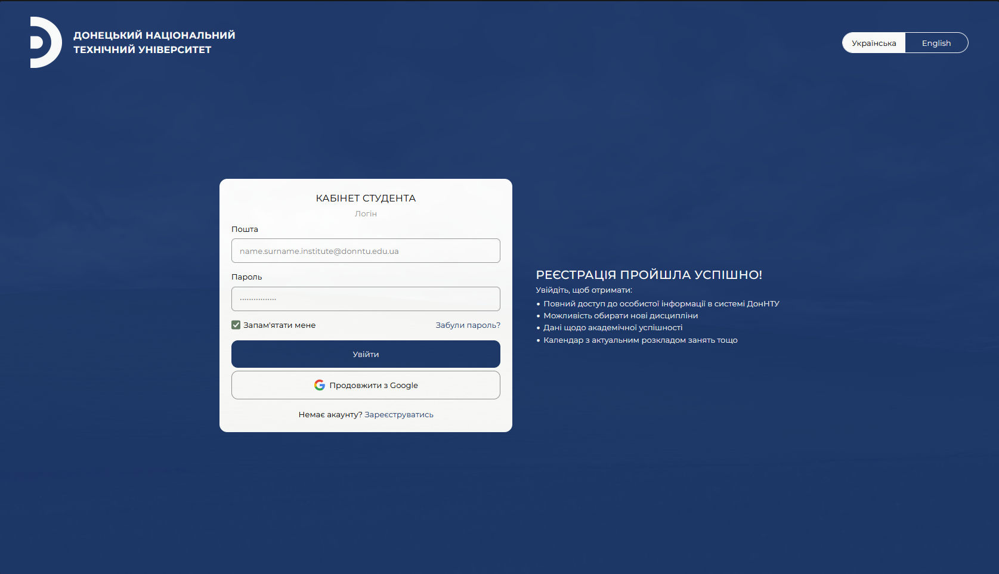

  <h1>Student's Office</h1>
  

    <a href="#-українська">Українська</a> • English (Soon)
  
 

  

    
    
  

  
  
<b>Фронт-енд частина веб-застосунку "Кабінет Студента"</b>

  
<i>The front-end portion of the "Student's Office" web app</i>

  

---

### Опис
**Student's Office** — аматорський проєкт, розроблений декілька студентами заради отримання навичок командної роботи та знань щодо різних галузей (в моєму випадку це фронт-енд).
Цей резопиторій зберігає саме фронт-енд частину проєкту

### Функції
* **Авторизація:** Повний набір фіч авторізації - логін, реєстрація, відновлення паролю, OAuth
* **Профіль:** Імплементовано таб зі статистичними даними студента (інші таби в розробці)
* **Мова:** Мається підтримка двох мов - української та англійської

### Посилання
student-app-web-dzdtfbh6ejcpgcdm.westus-01.azurewebsites.net
